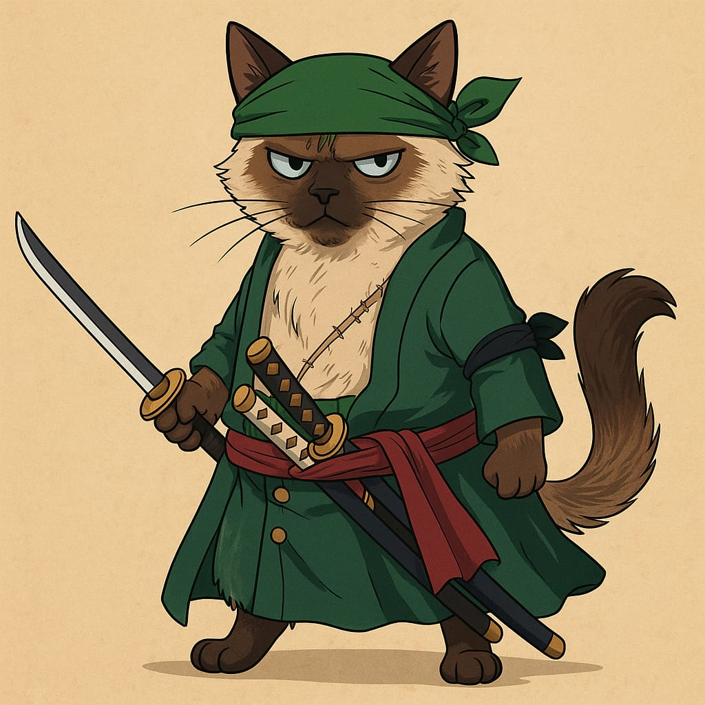

# 🐾 Homenagem ao Zoro

Há um ano, o Zoro chegou trazendo amor e paz para nossa casa — até a guerra entre gatos e cachorros deu uma trégua (risos). Com seu jeitinho doce, conquistou todos. Ontem, ele virou uma estrelinha deixando muita saudade.

Este é um projeto pessoal feito com HTML e CSS em homenagem ao Zoro. A página apresenta um carrossel 3D com 8 fotos giratórias, criando uma experiência visual leve e afetuosa.

🔗 **[Veja o projeto online aqui](https://brucsa.github.io/homenagem-zoro/)**

---

## 🌟 Funcionalidades

- Carrossel 3D animado com 8 imagens
- Reflexo suave abaixo das fotos
- Efeito de rotação contínua (360°)
- Estilo visual com fonte personalizada
- Totalmente responsivo e sem uso de JavaScript

---

## 🛠️ Tecnologias usadas

- HTML5
- CSS3 (animações, transformações 3D, `box-reflect`)
- Google Fonts: [Gochi Hand](https://fonts.google.com/specimen/Gochi+Hand)

---

## 📁 Estrutura de pastas
📂 homenagem-zoro/

├── index.html

├── style.css

├── img/

│ ├── background.jpg

│ ├── icon-espada.png

│ ├── img1.jpg

│ ├── img2.jpg

│ └── ... img8.jpg

---

## 💌 Agradecimentos
Este projeto é uma pequena homenagem ao Zoro, que trouxe muito amor à nossa casa.
Feito com carinho por @brucsa.